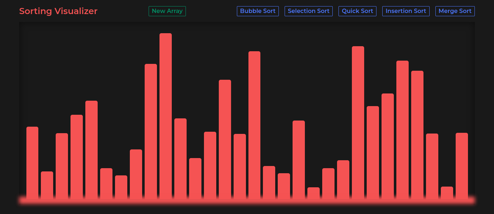

# Sorting Visualizer!

Welcome to Sorting Visualizer! As i was learning different sorting algorithms, i thought of visualizing it in actions. So i built this website. I learned a lot during this journey. Until now there is five algorithms, in future i will try to implement some more.

## Table of contents
- [Overview](#overview)
	 - [Screenshot](#screenshot)
	- [Run Project](#run)
	 - [Links](#links)
- [My process](#my-process)
  - [Built with](#built-with)
  - [What I learned](#what-i-learned)
- [Author](#author)

## Overview

### Screenshot

### Run
Clone the project

    git clone https://github.com/exxnnonymous/sorting-visualizer.git
Start the app

    npm start

### Links
- Live Site URL: (https://exxnnonymous.github.io/sorting-visualizer/)

## My process

### Built with
- [SASS](https://sass-lang.com/) - For styling
- Context API - For state management
- [React Js](https://nextjs.org/) - JavaScript Framework

### What I learned

I learned a lot while building this website. I also implemented testing using Jest and React-testing-library. I learnt more about SASS and Context API. I also improved my problem solving skills writing down the algorithms for animating and sorting the array and properly visualize it.

## Author

- Twitter - [@exxnnonymous](https://www.twitter.com/exxnnonymous)
- LinkedIn - [Sulav Bista](https://www.linkedin.com/in/sulav-bista/)